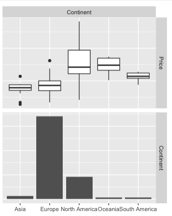
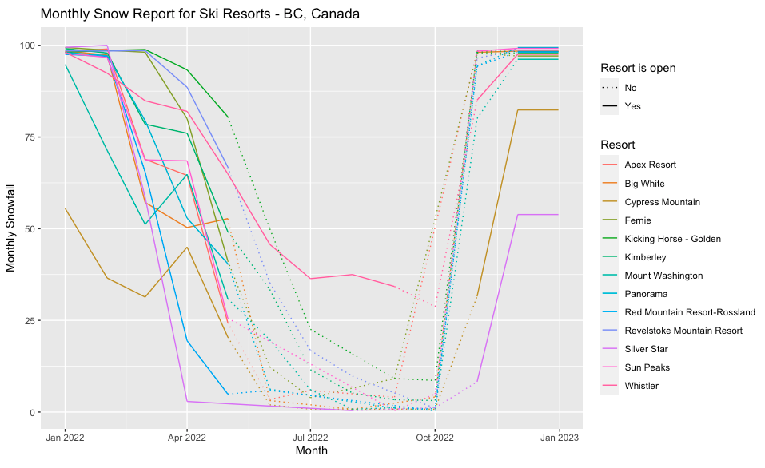
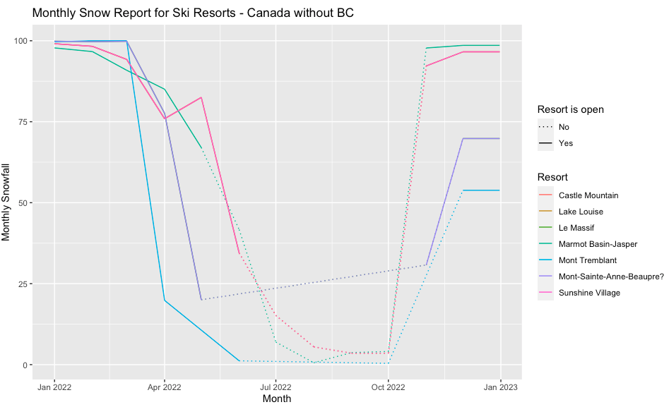
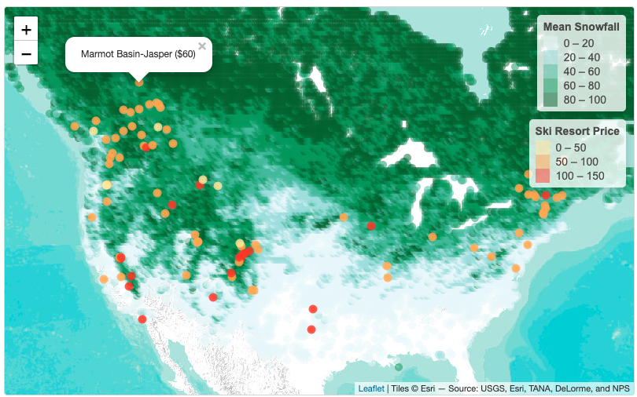

# Making Data-Driven Decisions When Planning Your Next Ski Trip

## Abstract

Ski resort pricing can be highly variable and complex, with factors such as location, area and maintenance costs. By analyzing pricing data, we can identify patterns and trends that help us understand the drivers of these price fluctuations and make better decisions about when and where to book our ski trips. 

In this project, I analyze the key factors that affect ticket price by building a regression model about price. In addition, an interactive map is built for ski enthusiasts to find the ski resort with the best snow. R markdown file can be found [here](./final_project_ski_resorts.Rmd) and the dataset is publicly avaiable on [Kaggle](https://www.kaggle.com/datasets/ulrikthygepedersen/ski-resorts?select=resorts.csv).

## Highlights

### Price vs Continent

Europe has the most number of ski resorts, followed by North America and Asia.

North America has the widest spread of price, followed by Europe. Asia and South America price are the most centralized.

North American resorts are significantly more expensive than resorts in other continents. Almost 50% of North America resorts are more expensive than the top-end (expensive) ski resorts in Europe, Asia, and South America.

### Canadian Ski Resorts

As shown in the figure, Whistler has the longest season among all Canadian resorts. It is the only place to go if you want to ski in early spring and summer. Kicking Horse in Golden, BC consistently has the most amount of snowfall when it is open. For most of the time, Cypress Mountain should be avoided for people who are looking for fresh snow. Even though Silver Star and Red Mountain also seem to be not having too much snow in early of the year, I think this is because March snow fall data is missing for those areas (they have descent amount of snow in Jan and Feb).

Alberta ski resorts generally have more snow than Quebec ski resorts. From January to March are the best months for Mont Tremblant, but it has the least amount of snow in other months.

Note: Sunshine Village, Lake Louise, and Castle Mountain are very close to each other so their lines overlap. Le Massif and Mont Sainte Anne also overlap.

### Interactive Map

This map shows the relationship among average annual snow fall and location and price of ski resorts. It is clear that the ticket price in US are generally more expensive than the ones in Canada.

### Price

Main factors that determine ski resort price are country, latitude, total lift capacity, number of difficult slopes. Interestingly, whether the ski resort operates in June is also a big factor. It could affects price by about $10. The final regression model achieves R-square of 0.77 and MAE of $6.6 on the test set.
